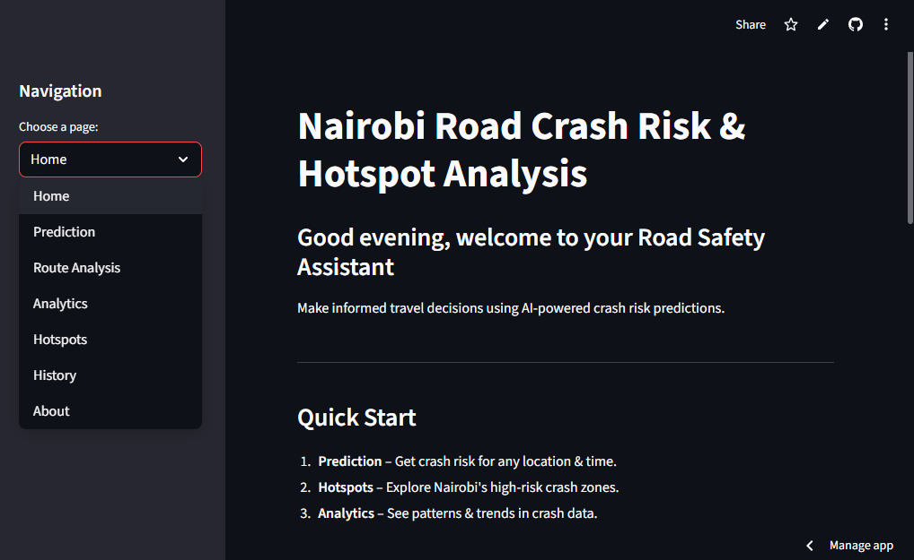

# Nairobi Road Crash Risk Prediction & Hotspot Detection

**Live Demo**: [Click here to access the deployed app](https://nairobi-road-crash-risk-prediction-hotspot-detection.streamlit.app/)
## Table of Contents
- [Introduction](#introduction)
- [Features](#features)
- [Getting Started](#getting-started)
  - [Prerequisites](#prerequisites)
  - [Installation](#installation)
- [Data Understanding](#data-understanding)
- [Exploratory Data Analysis](#exploratory-data-analysis)
- [Modeling](#modeling)
- [Deployment](#deployment)
- [Usage](#usage)
- [Conclusion](#conclusion)
- [Contributing](#contributing)
- [Authors](#authors)

## Introduction

The Nairobi Road Crash Risk Prediction & Hotspot Detection system is an AI-powered application designed to enhance road safety in Nairobi by predicting crash risks and identifying dangerous areas. Using machine learning algorithms trained on historical crash data, the system provides real-time risk assessments for specific locations and times, helping drivers, traffic authorities, and city planners make informed decisions to reduce road accidents.

The system analyzes various factors including time of day, day of week, geographic coordinates, and historical crash patterns to generate accurate risk predictions. It also employs clustering algorithms to identify crash hotspots across the city, providing valuable insights for traffic management and infrastructure planning.

## Features

- **Real-time Crash Risk Prediction**: Get instant risk scores for any location and time in Nairobi
- **Interactive Hotspot Mapping**: Visualize crash-prone areas using advanced clustering algorithms
- **Route Safety Analysis**: Evaluate crash risks along planned routes
- **Historical Data Analytics**: Explore crash patterns and trends over time
- **User-friendly Web Interface**: Streamlit-based dashboard for easy interaction
- **Personalized Safety Recommendations**: Context-aware safety tips based on predictions
- **Prediction History Tracking**: Keep track of your risk assessments over time

## Getting Started

### Prerequisites

To run this project, you need the following prerequisites:

- Python 3.8 or higher
- pandas
- numpy
- scikit-learn
- xgboost
- streamlit
- folium
- streamlit-folium
- plotly
- geopy
- joblib
- openpyxl
- seaborn
- matplotlib

### Installation

1. Clone this repository:
```bash
git clone https://github.com/Davies125/Nairobi-Road-Crash-Risk-Prediction-Hotspot-Detection
```

2. Change to the project directory:
```bash
cd nairobi-crash-risk-prediction
```

3. Install required packages:
```bash
pip install -r requirements.txt
```

4. Ensure you have the dataset file:
   - Place `nairobi-road-crashes-data_public-copy.xlsx` in the project root directory

5. Run the Jupyter notebook to train models (optional):
```bash
jupyter notebook index.ipynb
```

6. Launch the Streamlit application:
```bash
streamlit run nairobi-crash-app/app.py
```

## Data Understanding

The dataset contains comprehensive road crash records from Nairobi covering the period from August 2012 to July 2023. The data includes:

- **Geographic Information**: Latitude and longitude coordinates for crash locations
- **Temporal Data**: Date and time of crashes with extracted features (hour, day of week, month)
- **Crash Characteristics**: Information about fatalities, pedestrian involvement, vehicle types (matatu, motorcycle)
- **Severity Classifications**: Categorized crash severity levels (No Injury, Minor, Moderate, Severe)

The dataset comprises thousands of crash records with detailed location and contextual information, providing a robust foundation for machine learning model training and hotspot analysis.

## Exploratory Data Analysis

The analysis revealed several key insights:

- **Temporal Patterns**: Rush hours (7-9 AM, 4-7 PM) show higher crash frequencies
- **Geographic Distribution**: Certain areas of Nairobi exhibit significantly higher crash densities
- **Severity Analysis**: Severe crashes constitute a notable percentage of total incidents
- **Vehicle Type Patterns**: Different vehicle types show varying risk patterns throughout the day
- **Hotspot Identification**: DBSCAN clustering revealed distinct crash concentration areas

Visualizations include:
- Hourly crash distribution patterns
- Geographic scatter plots and heatmaps
- Severity category distributions
- Interactive Folium maps for spatial analysis

## Modeling

The system employs multiple machine learning approaches:

### Primary Models
1. **Random Forest Classifier**: Baseline model with balanced class weights
2. **Gradient Boosting Classifier**: Enhanced performance with boosting techniques
3. **XGBoost Classifier**: Best performing model with superior accuracy

### Model Features
- **Temporal Features**: Hour, day of week, month, rush hour indicators
- **Geographic Features**: Latitude and longitude coordinates
- **Contextual Features**: Weekend/weekday, night time indicators

### Model Performance
- **Best Model**: XGBoost Classifier
- **Accuracy**: 80%+ on test data
- **F1-Score**: Weighted average across all severity categories
- **Cross-validation**: Robust performance across different data splits

### Hotspot Detection
- **Algorithm**: DBSCAN clustering with haversine distance metric
- **Parameters**: 0.5km radius, minimum 5 crashes per cluster
- **Output**: Identified hotspot locations with risk scores

## Deployment

The application is deployed using Streamlit and can be accessed through a web browser. The deployment includes:

- **Streamlit Web App**: Interactive dashboard with multiple pages [Access the live application here](https://nairobi-road-crash-risk-prediction-hotspot-detection.streamlit.app/)
- **Model Persistence**: Trained models saved using joblib
- **Real-time Predictions**: Instant risk assessment capabilities
- **Interactive Maps**: Folium-based visualizations
- **Responsive Design**: Works across different screen sizes

### Deployment Options
1. **Local Deployment**: Run on local machine using `streamlit run`
2. **Cloud Deployment**: Compatible with Streamlit Cloud
3. **Container Deployment**: Docker support for consistent environments

## Usage

### Making Predictions
1. Navigate to the "Prediction" page
2. Enter location coordinates or select from predefined locations
3. Choose date and time for risk assessment
4. Click "Predict Risk" to get instant results
5. Review safety recommendations based on the prediction

### Exploring Hotspots
1. Go to the "Hotspots" page
2. Adjust detection parameters (radius, minimum crashes)
3. Click "Detect Hotspots" to identify dangerous areas
4. Explore the interactive map and hotspot rankings

### Route Analysis
1. Access the "Route Analysis" page
2. Enter start and end locations
3. Review risk scores along the planned route
4. Get route-specific safety recommendations

## Conclusion

The Nairobi Road Crash Risk Prediction system successfully demonstrates the application of machine learning for road safety enhancement. The XGBoost model achieved 80%+ accuracy in predicting crash severity categories, while the DBSCAN clustering algorithm effectively identified crash hotspots across Nairobi.

Key achievements include:
- Accurate risk prediction model with high performance metrics
- Effective hotspot detection using geospatial clustering
- User-friendly web interface for practical application
- Comprehensive safety recommendations based on predictions

Future improvements could include:
- Integration of real-time traffic data
- Weather condition incorporation
- Expanded geographic coverage
- Mobile application development
- Integration with traffic management systems

## Contributing

We welcome contributions from the community. If you'd like to contribute to this project, please follow these steps:

1. Fork the repository
2. Create a new branch for your feature:
```bash
git checkout -b feature-name
```
3. Make your changes and commit them:
```bash
git commit -m 'Add feature-name'
```
4. Push to the branch:
```bash
git push origin feature-name
```
5. Create a pull request

## Authors

- **[Victoria Jemutai](https://github.com/Victoria-ui227)**
- **[Margaret Kuria](https://github.com/shikoh-kuria)**
- **[Peter Njenga](https://github.com/PeterNjenga1)**
- **[Lucinda Wanjiru](https://github.com/lcmuri)**
- **[Davies Kiyaka](https://github.com/Davies125)**

---

**Note**: This system is built for educational and research purposes. Predictions should be used as guidance only and should not replace proper traffic safety measures and adherence to traffic laws.# Nairobi-Road-Crash-Risk-Prediction-Hotspot-Detection